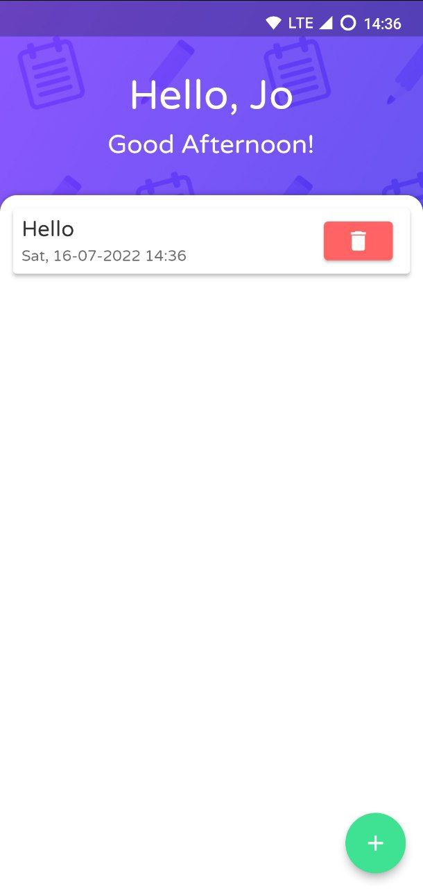
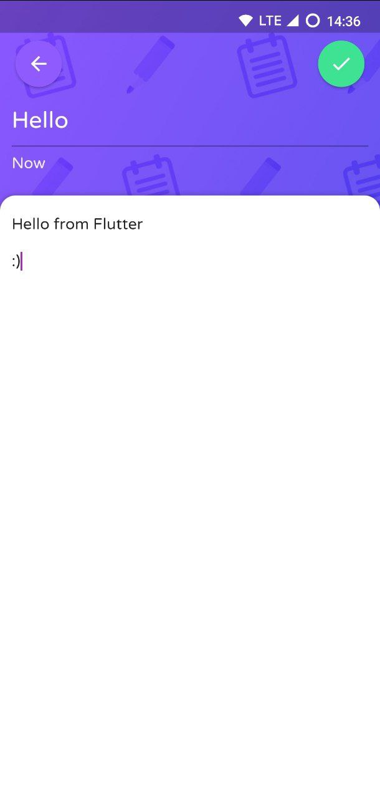

<h1 align="center">ViNote</h1>

  

    ViNote is a simple note app based on Flutter.
This application is made to complete the submission of <a href="https://www.dicoding.com/academies/159">Belajar Membuat Aplikasi Flutter untuk Pemula</a>

## Details
* #### Framework
  * Flutter 3.0.1
* #### Libraries
    * <a href="https://pub.dev/packages/hive">Hive</a>
    * <a href="https://pub.dev/packages/shared_preferences">Shared preferences</a>

## App
You can see a web demo here : [Vinote Web Demo](https://jo0707.github.io/viNote)

Find app for other platforms here : [Vinote Releases](https://github.com/jo0707/viNote/releases)

## Preview

## Note
#### This project is published only as a reference for friends, especially those who are studying at Dicoding. Do not plagiarize this project because there is no knowledge gained.

Dicoding class link : [Belajar Membuat Aplikasi Flutter untuk Pemula](https://www.dicoding.com/academies/159)

## Credit
* ### Joshua Sinaga
